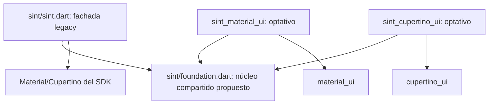

# Roadmap de convivencia Material/Cupertino en SINT

> **Revisión posterior:** el enfoque inicial vigente es
> [SintApp adaptativo con cambios acotados](sint-app-minimal.md). Este documento
> conserva el inventario de riesgos y la alternativa de núcleo neutral/adaptadores,
> pero su extracción en paquetes ya no es requisito del primer paso. La variante
> directa exige revisar el mínimo de SDK; el manifiesto sigue sin cambios.

Propuesta técnica del 12 de septiembre de 2026 para [issue #12](https://github.com/Open-Neom/sint/issues/12). Base: SINT 1.6.2, commit `139c6658ed55c2320f9774136294959b9ae81a54`.

Este documento define trabajo pendiente; no implementa la migración ni fija fechas. `foundation.dart`, `sint_material_ui` y `sint_cupertino_ui` son nombres propuestos, no APIs disponibles. Se revisará su disponibilidad antes de publicar.

El objetivo es que usuarios actuales conserven imports y comportamiento mientras otros adoptan standalone. Ambas integraciones compartirán estado, DI, rutas y traducciones. **La versión objetivo es SINT 1.7.0**, mediante integración optativa y contratos existentes compatibles. Cambiar tipos de APIs existentes o la fachada predeterminada requiere una decisión explícita de versión mayor; esos cambios quedan fuera de 1.7.0.

**Siguiente paso de implementación.** Crear un consumidor de prueba legacy y registrar el caso de #12; después introducir el contrato neutral entre el runtime y el host visual y probar una integración Material mínima. La prueba debe conservar identidad de estado/DI y las firmas legacy de `ConfigData`, `Sint.rootController` y rutas. Sólo entonces exponer el entrypoint neutral y completar los adaptadores. Publicar únicamente los avisos actuales no resuelve #12 ni constituye la nueva funcionalidad prevista para 1.7.0.

`sint` conserva Flutter >=3.32 / Dart >=3.8; los adaptadores se versionan y validan por separado con sus propios mínimos. No se incrementará la versión del manifiesto por este documento: se preparará el release cuando el soporte sea funcional y validado. La visión de producto de SINT 2.0 se decidirá por separado. SemVer comunica compatibilidad: una ruptura exige major aunque no introduzca una gran innovación. [Versionado Dart](https://dart.dev/tools/pub/versioning#semantic-versions).

**Selección: dependencias e imports, antes de compilar.** Existen dos ejes independientes:

| Familia visual | Integración SDK | Integración standalone |
|---|---|---|
| Material | `flutter/material.dart` | `material_ui/material_ui.dart` |
| Cupertino | `flutter/cupertino.dart` | `cupertino_ui/cupertino_ui.dart` |

Android/iOS, teléfono/tablet/desktop, `kIsWeb` y debug/profile/release no identifican qué biblioteca originó un `ThemeData`. Esas diferencias afectan presentación y validación. Se conservará la adaptación de gestos y transiciones por plataforma dentro de la integración seleccionada.

Los conditional imports estándar comprueban bibliotecas `dart.library.*`, no si la app migró Material. Un `--dart-define` o una comprobación runtime no transforma las firmas de `ThemeData`/`ThemeMode`. Un generador podría seleccionar archivos antes del build, pero no elimina requisitos de dependencias y añade configuración. La primera versión utilizará imports explícitos. [Dart](https://dart.dev/tools/pub/create-packages#conditionally-importing-and-exporting-library-files).

**Compatibilidad de SDK.** SINT declara Flutter >=3.32 y Dart >=3.8. Los pubspec actuales de Material/Cupertino standalone declaran Flutter >=3.44 y Dart >=3.12. Se fijarán versiones exactas para validar los mínimos; no se asume compatibilidad con todas las versiones futuras. [SINT](../../pubspec.yaml), [Material](https://raw.githubusercontent.com/flutter/packages/main/packages/material_ui/pubspec.yaml), [Cupertino](https://raw.githubusercontent.com/flutter/packages/main/packages/cupertino_ui/pubspec.yaml).

Agregar `material_ui` al paquete base elevaría el mínimo efectivo para todos sus consumidores, aunque no importen el entrypoint moderno: Pub resuelve el grafo completo. Las dependencias standalone vivirán en adaptadores separados y el paquete base no dependerá de ellos. [Dependencias Pub](https://dart.dev/tools/pub/dependencies).

**Arquitectura: conservar inicialmente el núcleo dentro de `sint`.**

`foundation.dart` será un entrypoint del paquete existente, no una copia del motor. Expondrá las mismas declaraciones canónicas de `Sint`, `Rx`, controllers, bindings y contratos de navegación que la fachada legacy. DI usa identidad de `Type`; duplicar clases o singletons rompería registros entre módulos. Las rutas y traducciones también compartirán ownership y lifecycle.

Neutral respecto al diseño no significa Dart puro: el núcleo puede usar `flutter/widgets.dart` y `foundation.dart`. Los adaptadores proporcionarán apps, construcción de rutas/overlays, temas y delegates visuales. Los contratos neutrales no recibirán ni devolverán `ThemeData`, `ScaffoldMessengerState` o clases específicas de un sistema visual. Cada adaptador conservará sus APIs temáticas fuertemente tipadas. `dynamic`, casts o conversiones parciales de temas no serán el mecanismo de compatibilidad.

El prototipo debe resolver registro de un host UI principal y creación de rutas mediante hooks neutrales. Las operaciones generales de navegación de ambas fachadas delegarán en el mismo runtime; los métodos temáticos pertenecerán a su adaptador. No habrá importación inversa desde el núcleo a los nuevos paquetes.

No se promete que todo el refactor sea compatible como minor: se conservarán firmas, nombres de extensiones, defaults, archivos de importación y tipos públicos legacy, incluidos `ConfigData` y `NavigationExtension.rootController: SintRootState`. Si una frontera no puede preservarse mediante delegación y reexports, su ruptura pasa a 2.0. Extraer físicamente otro paquete no es requisito inicial.

También se conservará `PageRedirect.getPageToRoute<T>`, cuyo retorno público es `SintPageRoute<T>` legacy. La fábrica neutral del `SintPage` canónico será un contrato adicional que devuelva `Route<T>`/`PageRoute<T>`; no se cambiará ese retorno público silenciosamente en una minor.

**Superficie de cambio verificada.** Hay 49 archivos con import Material SDK y 18 con Cupertino, con solapamientos. Algunos sólo requieren tipos básicos de Widgets; esos conteos no equivalen a APIs incompatibles.

| Área | Trabajo necesario | Contrato que conservar |
|---|---|---|
| [core/sint_core.dart](../../lib/core/sint_core.dart), aliases legacy | Separar el entrypoint neutral de reexports que arrastran Navigation/UI. | Declaraciones canónicas y aliases disponibles por fachada legacy. |
| [RouterReportManager](../../lib/navigation/src/router/router_report_manager.dart), Injection | Sustituir imports del barrel completo por dependencias pequeñas; lifecycle neutral. | Ownership por generación, mismo registro y `onClose` una vez. |
| [ConfigData](../../lib/navigation/src/domain/models/config_data.dart), [SintRoot](../../lib/navigation/src/ui/sint_root.dart) | Configuración/host neutral con wrappers legacy. | API y teardown existentes; sin roots que borren mutuamente DI/traducciones. |
| [SintMaterialApp](../../lib/navigation/src/ui/sint_material_app.dart), [SintCupertinoApp](../../lib/navigation/src/ui/sint_cupertino_app.dart) | Implementaciones tipadas por adaptador, `.router`, temas y keys. | Apps legacy sin cambiar imports ni argumentos. |
| [NavigationExtension](../../lib/navigation/src/domain/extensions/navigation_extensions.dart), [ContextExt](../../lib/navigation/src/domain/extensions/context_extensions.dart) | Separar navegación/MediaQuery de temas, manteniendo forwards legacy. | Rutas compartidas y tipos temáticos inequívocos. |
| [SintPage](../../lib/navigation/src/router/sint_page.dart), PageRedirect y mixins | Delegar creación de PageRoute/transiciones al host; no duplicar SintPage. | Parámetros, middleware, gestos, resultados y disposal. |
| Diálogos, sheets, snackbars, app bars | Tema, localización y Navigator del adaptador correcto. | Barreras, foco, accesibilidad, colas y cierre. |
| Translation y delegates | Mantener `.tr`; adaptar delegates visuales y cambios de locale. | Diccionarios y textos del sistema coherentes, incluido RTL. |

**Niveles de convivencia.**

1. Apps legacy y modernas dentro del ecosistema: objetivo inicial. Cada app selecciona su integración y no obliga a migrar las demás.
2. Módulos de ambos orígenes en un grafo: deben resolver el mismo núcleo y respetar fronteras de tipos. Registrar un controller por una fachada y recuperarlo por la otra devolverá exactamente la misma instancia. Se publicará una matriz de rangos/versiones compatibles.
3. Widgets de ambos orígenes en un árbol: soporte acotado, comenzando por host standalone con subárboles legacy y bridges oficiales. Las firmas que cruzan la frontera siguen necesitando migración. Los overlays pueden insertarse fuera del subtree protegido y requieren pruebas propias. No se promete simetría ni dos `SintMaterialApp` independientes activos; múltiples roots/scopes quedan fuera del primer alcance.

Compartir `Sint` y DI no hace compatibles `Sint.rootController`, `Sint.theme` ni `ConfigData` legacy bajo un host moderno. Los módulos que usan esas APIs deberán migrar dichas llamadas o permanecer dentro de un contrato legacy explícito; no se promete adaptación automática de getters tipados.

El bridge proporciona tema/localizaciones a descendientes; no adapta parámetros, retornos o callbacks públicos ni garantiza compatibilidad indefinida. [Límites oficiales](https://docs.flutter.dev/release/breaking-changes/material-ui-and-cupertino-ui#bridge-capabilities-and-limitations).

Los barrels modernos no expondrán extensiones temáticas legacy accidentalmente. En archivos que necesitan ambas APIs, un prefijo `as legacy` no basta para evitar ambigüedad de extensions: usar `show/hide` o invocación explícita de extensiones con nombres distintos. Se requiere un ejemplo compilable. [Conflictos Dart](https://dart.dev/language/extension-methods#api-conflicts).

**Entregas y criterios de salida.** Las fases 0–3 forman el alcance objetivo de SINT 1.7.0 y sus adaptadores. Dependen de compatibilidad comprobada; no se fijan fechas ni una retirada automática por calendario Flutter. Si una frontera exige romper contratos, se rediseña o se difiere fuera de esta minor. Las anotaciones de la fase 4 no son condición para publicar 1.7.0.

| Fase | Entrega | Criterio para avanzar |
|---|---|---|
| 0 — Contratos | Inventario de API/deep imports, fixture legacy, repro standalone y propuesta de host. | Baseline legacy verificable, diagnóstico reproducido y alcance acordado en #12. |
| 1 — Base de 1.7.0 | Entrypoint neutral, hooks, menos ciclos y wrappers compatibles. | Consumidores compilan sin cambios; mínimo SDK intacto; misma identidad de tipos/registros. Si falla, rediseñar o diferir la ruptura fuera de esta minor. |
| 2 — Preview optativa | Adaptadores Material/Cupertino, temas, contexto, overlays, locales y ejemplos. | Repro #12 funciona; pruebas de identidad entre fachadas y lifecycle completo. |
| 3 — Release 1.7.0 y adaptadores | Adaptadores estables, matriz y guía; pilotos voluntarios. | Emxi moderno y Gigmeout legacy en paralelo; Blup para overlays; mínimos/plataformas aprobados. Versiones propias de adaptadores y rangos de dependencia publicados. |
| 4 — Deprecación gradual | Documentación primero; avisos específicos después de estabilizar sustitutos. | Mensajes accionables, efecto CI probado, anuncio previo y ventana de soporte publicada. |
| 5 — Major futura, fuera de 1.7.0 | Evaluar fachada moderna predeterminada y rupturas inevitables junto con una visión de producto propia; distribución legacy identificable. | Guía/codemod revisable y política de soporte acordada. No retirar legacy automáticamente ni fijar 2.0 sólo por esta migración. |
| 6 — Retirada futura | Eliminar APIs legacy sólo en major anunciada. | Sustitutos estables, pilotos migrados, uso residual auditado y periodo comunicado cumplido. |

PRs propuestos: contratos/fixtures; entrypoint/host; Material; Cupertino/transiciones; overlays/localizaciones; ejemplos/guía/CI. Cada PR conserva compilación y pruebas de la fachada declarada. Resolver #12 implica cubrir sus APIs, no sólo aceptar `theme:`.

**Deprecación visible y gradual.**

- En preparación, documentar la integración SDK como legacy soportada y explicar destino. Distinguir la política SINT de la deprecación oficial de Flutter.
- No anotar una API cuyo reemplazo no está publicado/validado. No marcar `sint.dart`, `Sint` ni una librería común completa: afectaría también estado/DI/traducciones vigentes.
- Con adaptadores estables, anotar únicamente APIs visuales legacy. El mensaje debe indicar reemplazo exacto, mínimo SDK, guía y soporte, sin fechas de eliminación no acordadas.
- `@Deprecated` no impide ejecutar, pero genera diagnósticos. `flutter analyze` utiliza `fatal-infos: true` por defecto y puede hacer fallar el CI de consumidores. Anunciar y probar este cambio; ofrecer una línea de mantenimiento compatible durante la transición. No recomendar ignorar globalmente todos los avisos.
- Las anotaciones no se activan automáticamente por SDK/dispositivo. Para usuarios que no pueden subir SDK, explicar que el reemplazo requiere actualizarlo. Si los avisos crean presión prematura, mantener deprecación documental hasta la fase siguiente.
- Cambiar el tipo de una API existente sigue siendo ruptura aunque conserve nombre; agregar otra API optativa no autoriza a cambiar la anterior.

Fuentes: [Dart Deprecated](https://api.dart.dev/dart-core/Deprecated-class.html), [Flutter analyze](https://github.com/flutter/flutter/blob/stable/packages/flutter_tools/lib/src/commands/analyze.dart), [semver para esta migración](https://docs.flutter.dev/release/breaking-changes/material-ui-and-cupertino-ui#guidance-for-package-authors).

**Matriz de validación.** El [CI actual](../../.github/workflows/main.yml) usa Ubuntu con Flutter 3.32.0/3.44.4 para análisis/tests; no sustituye integración multiplataforma. La app de rendimiento dispone de runner macOS.

| Dimensión | Evaluación propuesta |
|---|---|
| SDK/dependencias | Legacy 3.32/Dart3.8; moderno mínimo verificado 3.44/Dart3.12; ambos 3.47/Dart3.13 y estable vigente fijado por revisión. Resolver mínimos y rangos admitidos. |
| APIs/widgets | Fixture legacy, standalone Material, standalone Cupertino y mixto acotado. Validar una instancia del núcleo. |
| Android | Emulador para integración y físico antes de release: back/predictive back cuando aplica, teclado, overlays y lifecycle. |
| iOS | Simulador y físico: swipe completo/cancelado, Cupertino, navegación anidada y sheets. |
| Web | Navegadores reales soportados; JS/Wasm como builds distintos, verificando backend y fallback: URLs, reload, path/hash, atrás/adelante y foco. |
| macOS/Windows/Linux | Build/smoke en host correspondiente: ventanas, resize, teclado, ratón y overlays. |
| Debug | Analyzer, tests y asserts para corrección/diagnósticos. |
| Profile/release | Builds finales/smoke y perfilado en equipos controlados. El modo no selecciona biblioteca visual. |

No ejecutar el producto cartesiano en cada PR: contratos/mínimos/tests/builds esenciales por PR; matriz completa de plataformas declaradas antes de release. Los dispositivos sirven para validar gestos, accesibilidad, memoria y renderizado.

Casos obligatorios: claro/oscuro/system y cambio dinámico; `context.theme`/`textTheme`; `scaffoldMessengerKey`; overlays con tema/locale; cambio de idioma, `.tr` y RTL; deep links/nested navigation; retorno de resultados; `onClose` exactamente una vez; liberación de timers/suscripciones; registro por una fachada y lookup por otra; error estático claro para mezclas no soportadas. Añadir cobertura de temas/delegates/gestos que las pruebas actuales no acreditan.

Rendimiento: harness y cargas equivalentes, SDK/renderer/dispositivo fijados, ABBA en misma máquina. Medir frames, CPU de actualización, allocations/heap y tamaño/carga web. Modularizar no garantiza mejorar benchmarks o bundle; separar dependencias resueltas por Pub de código retenido en el build.

**Pilotos y fronteras del ecosistema.** Muestras locales auditadas sin ejecutar Pub/Flutter:

| Piloto | Papel | Observación |
|---|---|---|
| Emxi | Primera app moderna. | Ya declara Flutter >=3.44/Dart >=3.12. Revisar declaración directa de SINT y resolución sin overrides locales. |
| Gigmeout | Control legacy; migración posterior voluntaria. | Comparte módulos visuales. Su mínimo declarado no prueba el mínimo efectivo de todo el grafo. |
| Blup | Overlays/navegación móvil. | 28 coincidencias locales de llamadas dialog/bottomSheet/snackbar; no son métricas de uso. BLE no decide integración visual. |

No basta migrar `main.dart`. `neom_commons.AppTheme` lee `Theme.of` legacy. `LoginService.sendEmailVerification(GlobalKey<ScaffoldState>)` en `neom_core` cruza un tipo Material con su implementación en `neom_auth`: migrar ambos lados juntos o añadir una API neutral con wrapper de transición. `DialogFactory` elige diálogo/web o sheet/móvil; esa selección se conserva y se prueba, sin usarla para detectar la biblioteca. Evaluar también el fallback MaterialApp/ThemeData de `SentinelApp`.

Los overrides pueden ocultar problemas de distribución. Antes de estabilidad: fixtures con dependencias publicadas/versionadas, rangos compatibles de módulos compartidos y compilación de apps legacy sin recibir paquetes standalone. Actualizar un módulo compartido no debe cambiar sus tipos públicos visuales bajo el mismo contrato que usan apps antiguas.

**Comunicación del avance.** Presentar soporte de los sistemas oficiales nuevos, migración optativa y continuidad del núcleo. La evolución de SINT no depreca formalmente GetX: eso lo determina su mantenimiento. La diferencia técnica se demuestra con APIs disponibles, compatibilidad y pruebas.

La validación de este documento es de código/documentación. Los adaptadores, hooks, fixtures, pruebas, anotaciones y migraciones descritos siguen pendientes de implementación.
